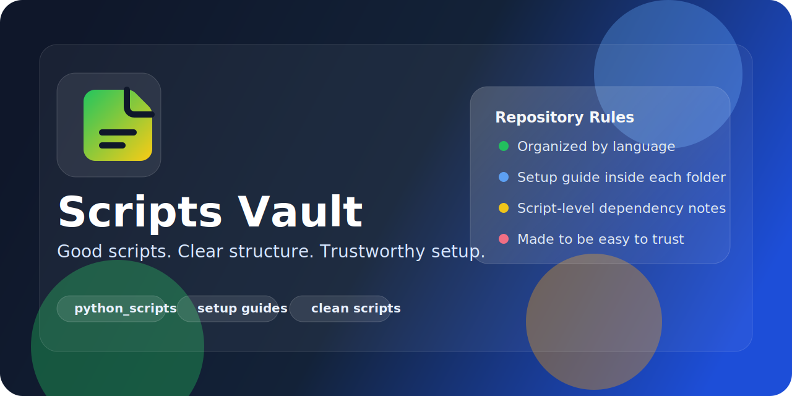

<p align="center">
  
</p>

<h1 align="center">Scripts Vault</h1>

<p align="center">
  Un vault curado de scripts utiles, organizados por lenguaje y documentados para que cualquier persona pueda instalarlos, entenderlos y ejecutarlos con confianza.
</p>

<p align="center">
  
  
  
  
</p>

<p align="center">
  <a href="#-que-es">Que es</a> •
  <a href="#-por-que-transmite-confianza">Por que transmite confianza</a> •
  <a href="#-estructura">Estructura</a> •
  <a href="#-empezar-rapido">Empezar rapido</a>
</p>

## Que es

`Scripts Vault` es un repositorio pensado para guardar solo scripts que realmente valen la pena.

La idea base del proyecto es:

- guardar scripts utiles
- organizarlos por lenguaje
- documentar cada entorno por carpeta
- dejar que cada script explique sus dependencias puntuales

## Por que transmite confianza

<table>
  <tr>
    <td width="50%" valign="top">
      <h3>🗂️ Orden claro</h3>
      <p>Cada lenguaje vive en su propia carpeta. Nada queda mezclado ni confuso.</p>
    </td>
    <td width="50%" valign="top">
      <h3>📘 Setup por carpeta</h3>
      <p>Cada carpeta incluye su propia guia para instalar o preparar ese lenguaje.</p>
    </td>
  </tr>
  <tr>
    <td width="50%" valign="top">
      <h3>🧩 Scripts documentados</h3>
      <p>Cada script puede indicar que librerias usa, como se ejecuta y que necesita.</p>
    </td>
    <td width="50%" valign="top">
      <h3>✨ Escalable</h3>
      <p>La estructura ya esta pensada para crecer con Python, JavaScript, Java, TypeScript y mas.</p>
    </td>
  </tr>
</table>

> La regla del repositorio es simple: el `README.md` presenta el proyecto y cada carpeta de lenguaje explica su propio entorno.

## Estructura

```text
scripts-vault/
|
|-- assets/
|   `-- readme-banner.svg
|
|-- python_scripts/
|   |-- PYTHON_SETUP.md
|   `-- remove_bg_to_webp.py
|
`-- README.md
```

## Carpetas disponibles

| Icono | Carpeta | Uso | Guia |
| --- | --- | --- | --- |
| 🐍 | [`python_scripts/`](python_scripts/) | Scripts y utilidades en Python | [`PYTHON_SETUP.md`](python_scripts/PYTHON_SETUP.md) |

Carpetas futuras que encajan perfecto en este vault:

- `javascript_scripts/`
- `typescript_scripts/`
- `java_scripts/`

## Script actual

El primer script incluido es:

- [`python_scripts/remove_bg_to_webp.py`](python_scripts/remove_bg_to_webp.py)

Este script convierte imagenes con fondo uniforme a `.webp` con transparencia y deja dentro del propio archivo sus notas de uso y dependencias concretas.

## Empezar rapido

<table>
  <tr>
    <td align="center"><strong>1</strong></td>
    <td>Entra a la carpeta del lenguaje que quieras usar.</td>
  </tr>
  <tr>
    <td align="center"><strong>2</strong></td>
    <td>Abre la guia de instalacion de esa carpeta.</td>
  </tr>
  <tr>
    <td align="center"><strong>3</strong></td>
    <td>Instala el lenguaje o runtime si hace falta.</td>
  </tr>
  <tr>
    <td align="center"><strong>4</strong></td>
    <td>Lee los comentarios del script para ver librerias y comandos propios.</td>
  </tr>
  <tr>
    <td align="center"><strong>5</strong></td>
    <td>Ejecuta el script.</td>
  </tr>
</table>

## Empieza por aqui

Si quieres comenzar con Python:

- [Abrir guia de Python](python_scripts/PYTHON_SETUP.md)
- [Abrir script actual](python_scripts/remove_bg_to_webp.py)

<details>
  <summary><strong>Vision del proyecto</strong></summary>
  <br />
  Este repositorio puede crecer como una coleccion limpia y confiable de:
  <ul>
    <li>scripts de procesamiento de imagen</li>
    <li>herramientas de conversion de archivos</li>
    <li>automatizaciones utiles</li>
    <li>utilidades para desarrollo</li>
    <li>colecciones por lenguaje con su propia guia de instalacion</li>
  </ul>

</details>
